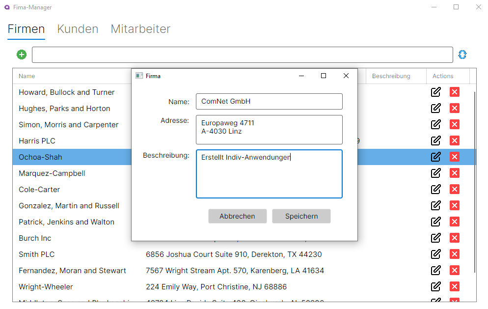

# CompanyManager With Rest Avalonia MVVM Anwendung

**Lernziele:**

- Wie mit dem **HttpClient** REST-Schnittstellen abgefragt werden.
- Wie mit einer Avalonia MVVM-Anwendung über die REST-API Daten abgefragt und manipuliert werden.

**Hinweis:** Als Startpunkt wird die Vorlage [CompanyManagerWithRestConApp](https://github.com/leoggehrer/CompanyManagerWithRestConApp/blob/master/README.md) verwendet.

## Vorbereitung

Bevor mit der Umsetzung begonnen wird, sollte die Vorlage heruntergeladen und die Funktionalität verstanden werden.

## Dialog-Konzept

Der Aufbau in dieser Anwendung besteht im Wesentlichen aus einer Übersichtsseite und einzelne Dialoge für die Erstellung, Bearbeitung und das Löschen von Einträgen. In der nachfolgenden Anwendung ist die Übersichtsseite für den `CompanyManager` abgebildet:


Als Hauptkomponente wird ein TabControl verwendet. Diese Komponente steuert die Umschaltung zwischen den einzelnen Entitäten **Firma**, **Kunde** und **Mitarbeiter**. Die einzelnen Registerkarten sind mit einem Filter, einer Lade-Aktion und einer Hinzufügen-Aktion ausgestattet. Erfolgt beim Filter eine Eingabe, werden die Einträge entsprechend dem Filterkriterium angezeigt. Die Lade-Aktion lädt die Daten erneut von der REST-API und wendet den Filter auf das Ladeergebnis an. Das Aktivieren der Hinzufüge-Aktion zeigt eine Dialog-Komponente zur Eingabe der Daten für eine Firma an. In unserem Fall sind das die Eigenschaften Name, Adresse und Beschreibung. In der nachfolgenden Abbildung ist das Eingabeformular für die Firma dargestellt:



Fehlende bzw. Ungültige Eingabe führen zu einer Fehlermeldung. Nachfolgend die Fehler-Anzeige für die Erstellung einer Firma mit gleichem Namen:


Fehler können auch bei der Bearbeitung von Einträgen entstehen. So kann durch das Ändern des Namens einer Firma eine Kollision mit einer bereits bestehenden Firma entstehen. In diesem Fall wird ebenfalls eine Fehlermeldung angezeigt. Die Bearbeitung wird durch den Button mit dem "Bearbeiten"-Symbol in der entsprechenden Zeile aktiviert.

Soll ein Eintrag gelöscht werden, dann muss der Button mit dem "Löschen"-Symbol in der entsprechende Zeile ausgewählt werden. Bevor jedoch der Eintrag in gelöscht wird, erfolgt eine Sicherheitsabfrage:


Nach Bestätigung der Operation erfolgt die Weiterleitung der Aktion an die REST-API. Durch die Ausführung kann es ebenfalls zu einem Fehler kommen. Z.B. kann mit dem Löschen die **Referentielle Integrität** verletzt werden. In diesem Fall wird ebenfalls eine Fehlermeldung angezeigt:


**Hinweis:** Dieses Dialog-Konzept kann auf die anderen Entitäten ebenfalls übertragen werden.

### Avalonia MVVM-Projekt erstellen

- Erstellen Sie ein neues Projekt vom Typ **Avalonia .NET MVVM App** und vergeben Sie den Namen **CompanyManager.RestMVVMApp**.
- Verbinden Sie das Projekt **CompanyManager.RestMVVMApp** mit dem Projekt **CompanyManager.Common**.

## Packages installieren

Überprüfen Sie in der Projekt-Datei (`CompanyManager.RestMVVMApp.csproj`) ob alle Packages installiert worden sind.

```xml
  <ItemGroup>
    <PackageReference Include="Avalonia" Version="11.2.1" />
    <PackageReference Include="Avalonia.Desktop" Version="11.2.1" />
    <PackageReference Include="Avalonia.Themes.Fluent" Version="11.2.1" />
    <PackageReference Include="Avalonia.Fonts.Inter" Version="11.2.1" />
    <!--Condition below is needed to remove Avalonia.Diagnostics package from build output in Release configuration.-->
    <PackageReference Include="Avalonia.Diagnostics" Version="11.2.1">
      <IncludeAssets Condition="'$(Configuration)' != 'Debug'">None</IncludeAssets>
      <PrivateAssets Condition="'$(Configuration)' != 'Debug'">All</PrivateAssets>
    </PackageReference>
    <PackageReference Include="CommunityToolkit.Mvvm" Version="8.2.1" />
    <PackageReference Include="ReactiveUI" Version="20.1.63" />
  </ItemGroup>
```
  
Falls Packages fehlen, fügen Sie die fehlenden Packages manuell hinzu. Das Hinzufügen des Packages erfolgt im Konsolen-Programm und die Anleitung dazu finden Sie [hier](https://github.com/leoggehrer/Slides/tree/main/NugetInstall).

## Erstellen der Models

Erstellen Sie im Projekt **CompanyManager.RestMVVMApp** einen Ordner **Models** und fügen Sie die Klassen **Company**, **Customer** und **Employee** hinzu.

Nachfolgend ein Beispiel für das **Company**-Model:

```csharp
/// <summary>
/// Represents a company entity.
/// </summary>
public class Company : ModelObject, Logic.Contracts.ICompany
{
    /// <summary>
    /// Gets or sets the name of the company.
    /// </summary>
    public string Name { get; set; } = string.Empty;

    /// <summary>
    /// Gets or sets the address of the company.
    /// </summary>
    public string? Address { get; set; }

    /// <summary>
    /// Gets or sets the description of the company.
    /// </summary>
    public string? Description { get; set; }
}
```

Diese Implementierung kann als Vorlage für alle anderen Models verwendet werden.

**Erläuterung:**

Die abstrakte Klasse `ModelObject` ist die Basisklasse für alle Models. Es beinhaltet die Eigenschaft `Id` (diese Eigenschaft stellen alle Models bereitstellen) und eine Methode `public virtual void CopyProperties(IIdentifiable other)`.
Die Klasse **Company** erbt die Eigenschaften und Methoden der Klasse `ModelObject` und ergänzt diese um weitere Eigenschaften und Methoden. Die Methoden `public virtual void CopyProperties(ICompany company)`und das Überschreiben der Methode `public override ToString()` ist für die Entität nicht erforderlich, sind aber im Verlauf für die weitere Entwicklung hilfreich.

```csharp
/// <summary>
/// Represents an abstract base class for model objects that are identifiable.
/// </summary>
public abstract class ModelObject : Logic.Contracts.IIdentifiable
{
    /// <summary>
    /// Gets or sets the unique identifier for the model object.
    /// </summary>
    public int Id { get; set; }
}
```

## Erstellen der ViewModels

In Avalonia sind ViewModels ein zentraler Bestandteil des MVVM (Model-View-ViewModel)-Patterns. Sie dienen als Vermittler zwischen der UI (View) und der Geschäftslogik (Model).

Hauptaufgaben eines ViewModels in Avalonia:

- Datenbereitstellung: Das ViewModel stellt der View über Bindings (Binding-Mechanismus) Daten zur Verfügung.
- Befehlssteuerung: Es implementiert Commands (ICommand), um Benutzerinteraktionen zu verarbeiten.
- Benachrichtigungen: Änderungen an Eigenschaften werden durch das Interface INotifyPropertyChanged an die View weitergeleitet.
- Trennung von UI und Logik: Das ViewModel enthält keine direkte UI-Logik, sondern hält die Anwendung testbar und modular.

### Erstellung des ViewModels `CompaniesViewModel`

Im ersten Schritt wird das **ViewModel** erstellt. Das bietet den Vorteil, dass bei der Erstellung der **View** das **ViewModel** gleich gebunden werden kann und die Entwicklung der Ansicht wesentlich vereinfacht wird.

Das `CompaniesViewModel` beinhaltet die Auflistung der `Company`-Einträge, den Filter und die Bearbeitungsoperationen wie Erstellen, Bearbeiten und Löschen.

```csharp
namespace CompanyManager.RestMVVMApp.ViewModels
{
    public partial class CompaniesViewModel : ViewModelBase
    {
        #region fields
        private string _filter = string.Empty;
        private readonly List<Models.Company> _companies = [];
        #endregion fields

        public RelayCommand LoadCompaniesCommand { get; }
        public string Filter
        {
            get
            {
                return _filter;
            }
            set
            {
                _filter = value;
                ApplyFilter(value);
                OnPropertyChanged();
            }
        }
        public ObservableCollection<Models.Company> Companies { get; } = [];

        public CompaniesViewModel()
        {
            LoadCompaniesCommand = new RelayCommand(async () => await LoadCompaniesAsync());

            PropertyChanged += (o, e) =>
            {
                if (e.PropertyName == nameof(Filter))
                {
                    LoadCompaniesCommand.NotifyCanExecuteChanged();
                }
            };

            _ = LoadCompaniesAsync();
        }
        private async Task LoadCompaniesAsync()
        {
            try
            {
                using var httpClient = new HttpClient { BaseAddress = new Uri(API_BASE_URL) };
                var response = await httpClient.GetStringAsync("companies");
                var companies = JsonSerializer.Deserialize<List<Models.Company>>(response, _jsonSerializerOptions);

                if (companies != null)
                {
                    _companies.Clear();
                    foreach (var company in companies)
                    {
                        _companies.Add(company);
                    }
                    ApplyFilter(Filter);
                }
            }
            catch (Exception ex)
            {
                Console.WriteLine($"Error loading companies: {ex.Message}");
            }
        }
        private async void ApplyFilter(string filter)
        {
            // UI-Update sicherstellen
            await Dispatcher.UIThread.InvokeAsync(() =>
            {
                Companies.Clear();
                foreach (var company in _companies)
                {
                    if (company.ToString().Contains(filter, StringComparison.OrdinalIgnoreCase))
                    {
                        Companies.Add(company);
                    }
                }
            });
        }
        [RelayCommand]
        public async Task ExecuteAddCommand()
        {
            var companyWindow = new CompanyWindow();
            var viewModel = new CompanyViewModel { CloseAction = companyWindow.Close };
            companyWindow.DataContext = viewModel;
            // Aktuelles Hauptfenster als Parent setzen
            var mainWindow = (Application.Current?.ApplicationLifetime as IClassicDesktopStyleApplicationLifetime)?.MainWindow;
            if (mainWindow != null)
            {
                companyWindow.Closed += (s, e) => _ = LoadCompaniesAsync();
                await companyWindow.ShowDialog(mainWindow);
            }
        }
        [RelayCommand]
        public async Task ExecuteEditItemCommand(Models.Company company)
        {
            var companyWindow = new CompanyWindow();
            var viewModel = new CompanyViewModel { Model = company, CloseAction = companyWindow.Close };

            companyWindow.DataContext = viewModel;

            // Aktuelles Hauptfenster als Parent setzen
            var mainWindow = (Application.Current?.ApplicationLifetime as IClassicDesktopStyleApplicationLifetime)?.MainWindow;

            if (mainWindow != null)
            {
                companyWindow.Closed += (s, e) => _ = LoadCompaniesAsync();
                await companyWindow.ShowDialog(mainWindow);
            }
        }
        [RelayCommand]
        public async Task ExecuteDeleteItemCommand(Models.Company company)
        {
            var messageDialog = new MessageDialog("Delete", $"Wollen Sie die Firma '{company.Name}' löschen?", MessageType.Question);
            // Aktuelles Hauptfenster als Parent setzen
            var mainWindow = (Application.Current?.ApplicationLifetime as IClassicDesktopStyleApplicationLifetime)?.MainWindow;

            await messageDialog.ShowDialog(mainWindow!);

            if (messageDialog.Result == MessageResult.Yes)
            {
                using var httpClient = new HttpClient { BaseAddress = new Uri(API_BASE_URL) };


                var response = await httpClient.DeleteAsync($"companies/{company.Id}");

                if (response.IsSuccessStatusCode == false)
                {
                    messageDialog = new MessageDialog("Error", "Beim Löschen ist ein Fehler aufgetreten!", MessageType.Error);
                    await messageDialog.ShowDialog(mainWindow!);
                }
                else
                {
                    _ = LoadCompaniesAsync();
                }
            }
        }
    }
}
```

#### Erstellung der View  `CompaniesUserControl`

In den meisten Fällen ist es sinnvoll, dass die Ansicht als `UserControl` entwickelt wird. Das hat den Vorteil, dass die Ansicht vielseitig eingesetzt werden kann.

### Testen des Systems

- Testen Sie die REST-API mit dem Programm **Postman**. Ein `GET`-Request sieht wie folgt aus:

```bash
GET: https://localhost:7074/api/companies
```

Diese Anfrage listet alle `Company`-Einträge im json-Format auf.

> **ACHTUNG:** `CompanyManager.WebApi` ist eine ausführbares Projekt und benötigt eigene `AppSettings`-Dateien. Kopieren Sie die beiden `appsettings`-Dateien aus dem Projekt `CompanyManager.ConApp` in das Projekt `CompanyManager.WebApi` und passen Sie die Verbindungszeichenfolge an.

## Hilfsmittel

- keine

## Abgabe

- Termin: 1 Woche nach der Ausgabe
- Klasse:
- Name:

## Quellen

- keine Angabe

> **Viel Erfolg!**
